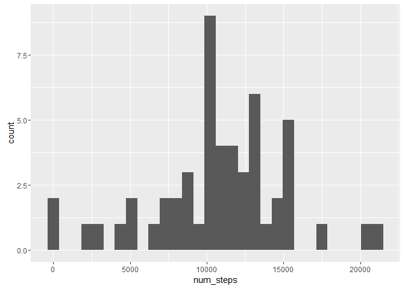
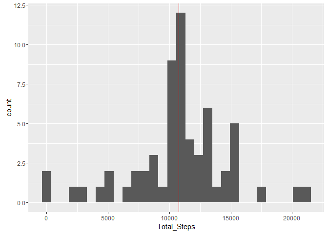
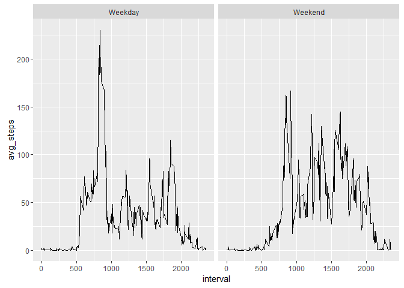

# Reproducible Research: Peer Assessment 1
Saurabh  
10 April 2016  

## Loading and preprocessing the data


```r
setwd("~/Analytics/Data Science/Coursera/5. Reproducible Research")
steps_data<-read.csv("activity.csv")
str(steps_data)
```

```
## 'data.frame':	17568 obs. of  3 variables:
##  $ steps   : int  NA NA NA NA NA NA NA NA NA NA ...
##  $ date    : Factor w/ 61 levels "2012-10-01","2012-10-02",..: 1 1 1 1 1 1 1 1 1 1 ...
##  $ interval: int  0 5 10 15 20 25 30 35 40 45 ...
```

```r
steps_data$date<-as.Date(as.character(steps_data$date))
str(steps_data)
```

```
## 'data.frame':	17568 obs. of  3 variables:
##  $ steps   : int  NA NA NA NA NA NA NA NA NA NA ...
##  $ date    : Date, format: "2012-10-01" "2012-10-01" ...
##  $ interval: int  0 5 10 15 20 25 30 35 40 45 ...
```


## What is mean total number of steps taken per day?


```
## Warning: package 'sqldf' was built under R version 3.2.5
```

```
## Loading required package: gsubfn
```

```
## Warning: package 'gsubfn' was built under R version 3.2.5
```

```
## Loading required package: proto
```

```
## Warning: package 'proto' was built under R version 3.2.3
```

```
## Loading required package: RSQLite
```

```
## Warning: package 'RSQLite' was built under R version 3.2.5
```

```
## Loading required package: DBI
```

```
## Warning: package 'DBI' was built under R version 3.2.5
```

```
## Warning: package 'ggplot2' was built under R version 3.2.5
```

```
## Loading required package: tcltk
```

```
## `stat_bin()` using `bins = 30`. Pick better value with `binwidth`.
```

```
## Warning: Removed 8 rows containing non-finite values (stat_bin).
```

```
## Warning: Removed 1 rows containing missing values (geom_vline).
```



```
##    Min. 1st Qu.  Median    Mean 3rd Qu.    Max.    NA's 
##      41    8841   10760   10770   13290   21190       8
```

## What is the average daily activity pattern?
Interval=835, where average number of steps is maximum


```r
library(sqldf)
df<-sqldf("select interval, avg(steps) as avg_steps from steps_data group by interval")
library(ggplot2)
g<-ggplot(df,aes(interval,avg_steps))
g+geom_line()
```


## Imputing missing values
Total number of missing values `sum(is.na(steps_data))`. Only steps column has missing values in the dataframe.

Adding a columns with average steps against each interval so that it can be used to replace missing values. Once added then using mutate function to modify the data.


```r
library(sqldf)
steps_data_2<-sqldf("select a.date, a.interval, b.avg_steps,a.steps
                       from  steps_data a left join df b on a.interval=b.interval")
library(dplyr)
```

```
## Warning: package 'dplyr' was built under R version 3.2.5
```

```
## 
## Attaching package: 'dplyr'
```

```
## The following objects are masked from 'package:stats':
## 
##     filter, lag
```

```
## The following objects are masked from 'package:base':
## 
##     intersect, setdiff, setequal, union
```

```r
steps_final<-mutate(steps_data_2, steps_full=ifelse(is.na(steps),avg_steps,steps))
steps_final<-select(steps_final,date,interval,steps_full)
```

Making a historgram and seeing the summary stats for imputed data set

```r
library(sqldf)
library(ggplot2)
steps_final_hist<-sqldf("select date, sum(steps_full) as Total_Steps from steps_final group by date")
g<-ggplot(steps_final_hist,aes(x=Total_Steps))
g+geom_histogram()+geom_vline(xintercept=mean(steps_final_hist$Total_Steps), color="red")
```

```
## `stat_bin()` using `bins = 30`. Pick better value with `binwidth`.
```



```r
summary(steps_final_hist$Total_Steps)
```

```
##    Min. 1st Qu.  Median    Mean 3rd Qu.    Max. 
##      41    9819   10770   10770   12810   21190
```


## Are there differences in activity patterns between weekdays and weekends?


```r
steps_final<-mutate(steps_final, day=ifelse(weekdays(date)=="Saturday" |weekdays(date)
                                                      =="Sunday","Weekend","Weekday"))
df_final<-sqldf("select interval,day, avg(steps_full) as avg_steps from steps_final
                group by interval,day")
g<-ggplot(df_final,aes(interval,avg_steps))
g+geom_line()+facet_grid(.~day)
```


